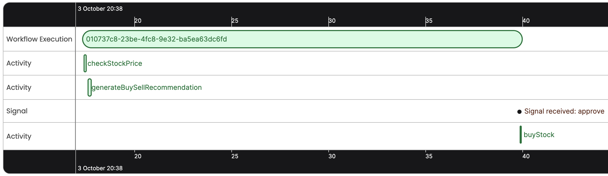

## Temporal Sample: Orchestrate Lamdba Functions

A Temporal Version of [AWS Step Functions: Lambda orchestration example](https://docs.aws.amazon.com/step-functions/latest/dg/sample-lambda-orchestration.html)

#### Deploy AWS Lambda microservices and APIs (Optional)

The file `.env_example` already contains a deployed URL of Lambda microservices. To deploy on your own URL, [refer to the deployment readme](./deploy/README.md).

#### Configuration
- Copy the `.env_example` file to `.env.development` and change settings to match your temporal installation.
- Omit CERT_PATH, KEY_PATH, ADDRESS, NAMESPACE to use a local Temporal Server

#### Run a Temporal Server ([Guide](https://docs.temporal.io/kb/all-the-ways-to-run-a-cluster#temporal-cli))
- `brew install temporal`
- `temporal server start-dev` (Temporal Server web UI: localhost:8233)

#### Install Dependencies
- `npm install`

#### Run a Developer environment
  - `npm run start`

#### Run workers (required to execute workflows)
  - `npm run worker`

#### Start a workflow
- Go to `http://localhost:3000/runWorkflow`
- The workflow will make a stock trading recommendation based on price then wait for an 'approve' signal.

#### (Advanced) Debug/replay Workflow histories with the [Temporal VSCode Extension](https://marketplace.visualstudio.com/items?itemName=temporal-technologies.temporalio)
- Open /server as a VSCode project
- Run the replayer on a downloaded workflow JSON file
